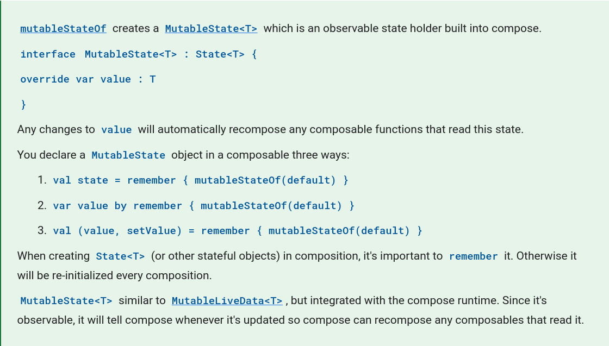
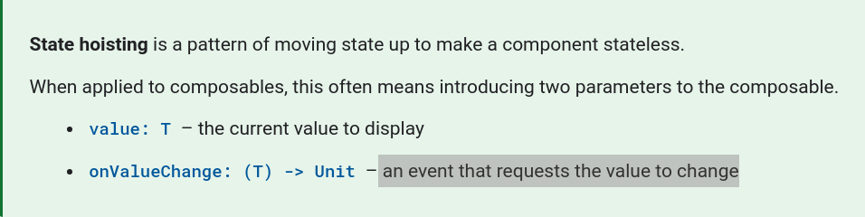

# Using State in Jetpack Compose

## Concepts:
- viewModel
- remember
- State
- MutableState
- using mutableStateOf in viewModel and see how it simplifies state code compared to LiveData when targeting Compose

## Important notes to remember:

